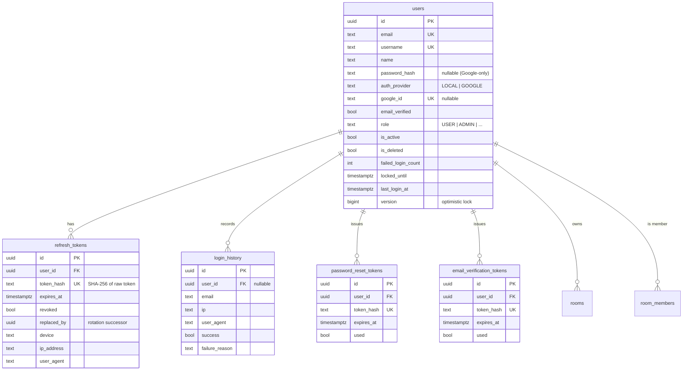
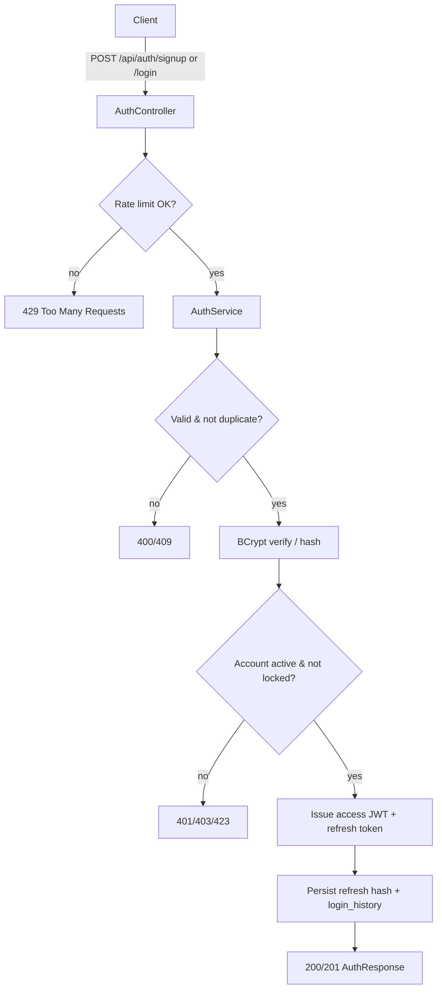
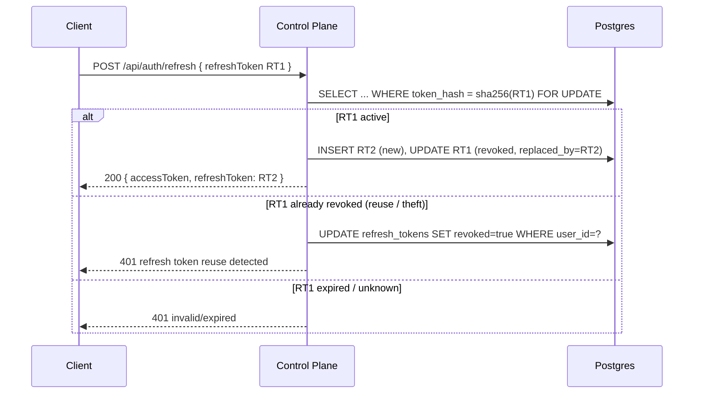
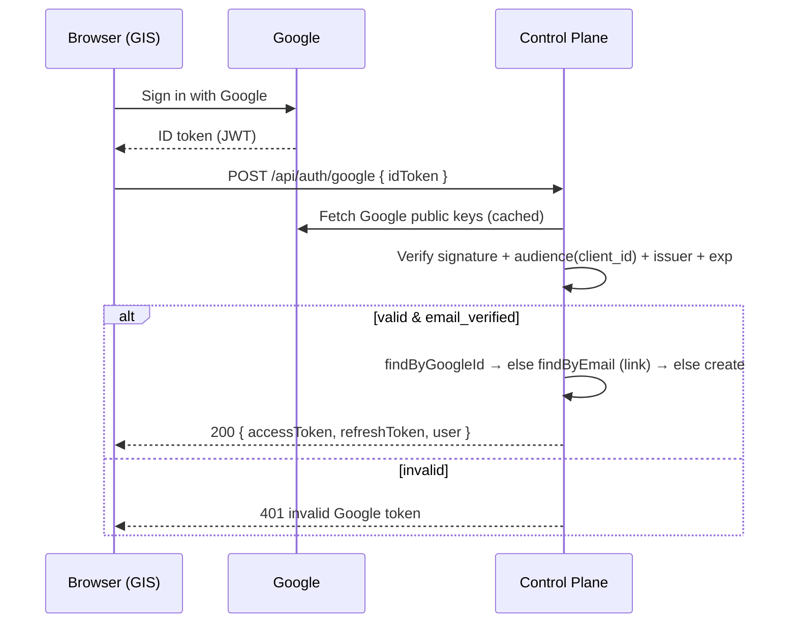

# Collide Control Plane — Authentication

Production auth for Collide: email/password + "Continue with Google", short-lived JWT
access tokens (also verified by the Node sync server), and rotating, hashed refresh
tokens. This service is the **Control Plane** referenced in the workspace `CLAUDE.md`;
it extends the existing `control/` Spring Boot app rather than replacing it.

- **Stack:** Java 17, Spring Boot 4.1, Spring Security 6, Spring Data JPA/Hibernate,
  Flyway, PostgreSQL, Gradle.
- **Tokens:** HS256 JWT access token (default 15 min) + opaque refresh token
  (default 30 days, rotated on every use, only the SHA-256 hash is stored).

> The access-token secret is byte-identical to the sync server's `JWT_SECRET`, so one
> token authenticates both the REST API and the collaboration WebSocket.

---

## 1. Folder structure

```
control/
├── build.gradle                     # deps: security, jpa, flyway, jjwt, google-api-client, testcontainers
├── Dockerfile                       # multi-stage build → non-root JRE image
├── deploy/k8s.yaml                  # Deployment + Service (probes, non-root, HPA-ready)
├── docs/AUTH.md                     # this file
└── src/
    ├── main/java/app/collide/control/
    │   ├── auth/                     # AuthController, AuthService, JwtService,
    │   │   ├── dto/                  #   RefreshTokenService, GoogleTokenVerifier,
    │   │   │                         #   LoginSecurity, JwtAuthFilter, AuthPrincipal
    │   │   └── ...
    │   ├── user/                     # User entity, AccountRole, AuthProvider, repo, mapper
    │   ├── token/                    # RefreshToken + reset/verification tokens + repos
    │   ├── audit/                    # LoginHistory + repo
    │   ├── security/                 # RateLimiter (+ in-memory impl)
    │   ├── config/                   # SecurityConfig, entry point, access-denied handler
    │   ├── common/                   # ApiResponse, ErrorResponse, ApiException, Tokens, ClientInfo
    │   ├── room/ , link/             # (pre-existing) rooms, members, share links
    │   └── validation/               # @StrongPassword
    └── main/resources/
        ├── application.yml
        ├── static/openapi.yaml       # served at GET /openapi.yaml
        └── db/migration/
            ├── V1__init.sql          # users, rooms, room_members, share_links
            └── V2__auth.sql          # extends users + refresh/history/reset/verify tables
```

Layering is strict: **Controller → Service → Repository → DB**. Entities never leave the
service layer — everything crosses the wire as a DTO.

---

## 2. Data model (ER)



---

## 3. Signup / login flow



Login failures increment `failed_login_count` and write `login_history` in a **separate
transaction** (`REQUIRES_NEW`), so the audit + lockout survive the thrown 401.

---

## 4. Refresh-token rotation & reuse detection



A legitimate client discards RT1 the instant it receives RT2, so a *revoked* token
arriving later means it was stolen → the whole token family is revoked. The `FOR UPDATE`
row lock serialises concurrent refreshes so two successors can't be minted.

---

## 5. Continue with Google (ID-token verification)



We **never** trust profile fields sent by the frontend — identity comes only from the
verified token. An existing LOCAL account with the same email is *linked* to the Google
identity rather than duplicated.

---

## 6. JWT / access-token model

Access-token claims (HS256):

| claim | value | consumer |
|-------|-------|----------|
| `sub` | userId (UUID) | REST API **and** sync server |
| `name` | display name | REST API **and** sync server |
| `email`, `username` | identity | REST API |
| `roles` | e.g. `["USER"]` → `ROLE_USER` | REST API method security |
| `iss`, `iat`, `exp` | issuer/time | both |

The sync server ([sync/src/auth/jwt.ts](../../sync/src/auth/jwt.ts)) reads `sub` + `name`.
Because a 15-min access token expires while a WebSocket may stay open for hours, the SPA
refreshes and reconnects: auth is checked at connect time, and the frontend keeps the
collab socket's token current (`setCollabToken` in `collide/src/collab/yjs.ts`).

---

## 7. Environment variables

| Var | Default | Purpose |
|-----|---------|---------|
| `DATABASE_URL` | `jdbc:postgresql://localhost:5432/collide` | JDBC URL |
| `DB_USER` / `DB_PASSWORD` | `collide` / `collide` | DB creds |
| `JWT_SECRET` | dev secret | HS256 secret — **must match the sync server** |
| `ACCESS_TTL_SECONDS` | `900` | Access-token lifetime |
| `REFRESH_TTL_SECONDS` | `2592000` | Refresh-token lifetime |
| `GOOGLE_CLIENT_ID` | *(empty)* | Enables Google login when set |
| `CORS_ALLOWED_ORIGINS` | `http://localhost:5173` | Comma-separated allowlist |
| `LOCKOUT_MAX_FAILURES` | `5` | Failures before lockout |
| `LOCKOUT_DURATION_SECONDS` | `900` | Lockout duration |
| `RL_LOGIN_MAX` / `RL_LOGIN_WINDOW` | `10` / `60` | Login rate limit |
| `RL_SIGNUP_MAX` / `RL_SIGNUP_WINDOW` | `5` / `3600` | Signup rate limit |

---

## 8. Deployment

**Docker Compose** (from `collab/collab/`):

```bash
docker compose up --build           # postgres + redis + control (:8080)
```

**Kubernetes:** see [deploy/k8s.yaml](../deploy/k8s.yaml) — Deployment (2 replicas,
liveness/readiness on `/actuator/health`, non-root, resource limits) + ClusterIP Service.
Put a TLS-terminating ingress / reverse proxy (nginx) in front; the app speaks plain HTTP.
The service is stateless (JWT), so it scales horizontally; move the rate limiter to Redis
for multi-replica correctness.

**Health:** `GET /actuator/health`. **Graceful shutdown:** enabled (20s drain on SIGTERM).

---

## 9. Security summary (OWASP mapping)

| Risk | Mitigation |
|------|-----------|
| Broken auth / brute force | BCrypt(12), per-account lockout, per-IP rate limit |
| Credential stuffing | Lockout + rate limit + login audit |
| Account enumeration | Generic "invalid credentials" + dummy BCrypt compare (timing) |
| Token theft / replay | Refresh rotation + reuse detection → revoke-all; only hashes stored |
| JWT tampering | HS256 signature verify; identity from token, never client fields |
| Session fixation | Stateless — no server sessions |
| Mass assignment | Narrow DTOs; email/username/role not editable via profile update |
| IDOR | userId taken from the verified token, not the request |
| SQL injection | JPA/parameterised queries only |
| Lost update / races | `@Version` optimistic lock + `FOR UPDATE` on hot paths; unique constraints |
| Open redirect | No redirects in the API (ID-token flow, not auth-code) |
| Sensitive logging | Only ids/emails logged — never passwords/tokens |
```
